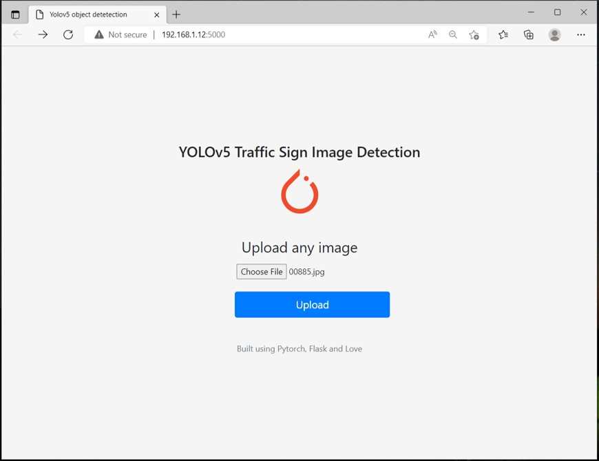
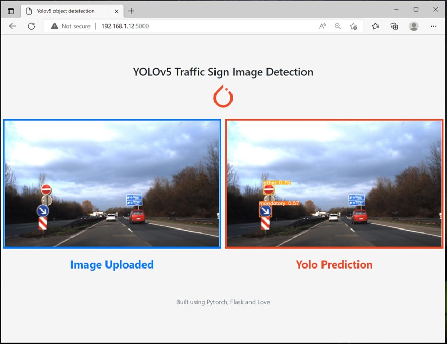

# Yolo_object_detection

Simple flask app to detect category of traffic signals as  *prohibitory*, *danger*, *mandatory* or *other*  from image uploaded.

 

### Software and Account Requirement


1. [Github Account](https://github.com/)
2. [Google Colab Account](https://colab.research.google.com/)
3. [VS Code IDE](https://code.visualstudio.com/Download)
4. [Gitcli](https://git-scm.com/downloads)
5. [Kaggle Account](https://www.kaggle.com) optional

## Environment Setup
Create new environment
```conda create -n env python=3.7```
</br>Activating environment  ```conda activate env```
</br>Deactivating environment
```conda deactivate```
## Requirements
Installing requirements
```pip install requirements.txt```
## Local Deployment
Running app to local server
```python app.py```
## References
- Dataset https://www.kaggle.com/datasets/valentynsichkar/traffic-signs-dataset-in-yolo-format
- Yolo https://github.com/ultralytics/yolov5
- App inspiration https://github.com/avinassh/pytorch-flask-api-heroku
